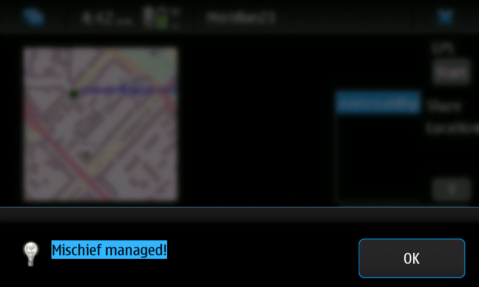

http://norayr.am/meridian23/

This is my new application for maemo and any GNU + Linux: p2p location sharing.
It follows decentralized approach, where it is not necessary to pass your location to some central server, like it is done in case of google latitude.
Just login with your jabber account to your favourite xmpp server.
Application will show those of your friends who are logged in with the same application, but they may use other jabber servers.
some info at TMO
I intent to port it to SHR on GTA02 and Nemomobile on n900 too. This app soon will be uploaded to extras-devel for maemo fremantle and I think it shold work under maemo diablo too.
License is GPLv3.

uxmpp library by Devi is used ( https://github.com/devi/uxmpp ), changed to compile with fpc (freepascal compiler), added TPresenceEvent, TIqVcardEvent, modified ParsingPresence and ParsingIq methods (search for "noch" to see the changes).

Also, I may consider to rewrite whole project from scratch.

